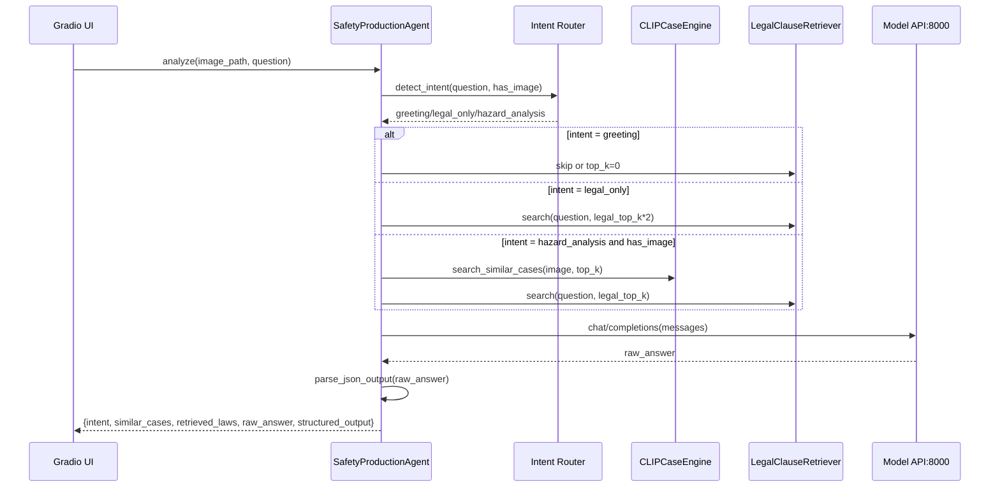

# 项目理解报告 v2

## 0. 技术栈（准确且详细）

本节按“声明依赖、代码实际使用、运行时组件”三层给出准确口径，避免仅凭 requirements 产生偏差。

### 0.1 语言与运行时

| 维度 | 技术 | 版本信息 | 证据 |
|---|---|---|---|
| 后端主语言 | Python | >=3.10 | pyproject.toml |
| 前端辅助服务语言 | TypeScript/Node.js | TypeScript ^4.5.4, ts-node ^10.4.0 | web-service-app/package.json |
| 包管理/构建 | setuptools + wheel | setuptools>=68 | pyproject.toml |
| WebUI 运行方式 | Gradio 进程 | 由 Python 脚本直接启动 | scripts/run_agent_webui.py |
| API 服务方式 | FastAPI + Uvicorn | 代码显式使用 uvicorn.run | scripts/run_ingestion_api.py |

### 0.2 Python 依赖（已在项目依赖文件声明）

| 分类 | 组件 | 版本口径 | 主要用途 | 证据 |
|---|---|---|---|---|
| LLM 编排 | langchain | >=0.3.0 | Prompt/文档对象与向量检索接口兼容 | pyproject.toml |
| 模型推理 | transformers | >=4.40.0 | CLIP 模型与处理器 | pyproject.toml |
| 深度学习 | torch | >=2.1.0 | CLIP 推理与张量计算 | pyproject.toml |
| 图像处理 | pillow | >=10.0.0 | 图像读取与处理 | pyproject.toml |
| 文档解析 | python-docx | >=1.1.0 | Word 结构化抽取 | pyproject.toml |
| PDF 解析 | pymupdf | >=1.24.0 | PDF 文本/图片抽取 | pyproject.toml |
| PDF 备选 | pypdf | >=4.0.0 | 依赖已声明（当前主链路未见直接调用） | pyproject.toml |
| 检索库 | faiss-cpu | >=1.8.0 | 依赖已声明（当前主链路以 Chroma 为主） | pyproject.toml |
| HTTP 客户端 | requests | >=2.31.0 | 模型 API 与服务调用 | pyproject.toml |
| 评估绘图 | matplotlib | >=3.8.0 | 离线评估可视化 | pyproject.toml |
| 数值计算 | numpy | >=1.26.0 | 评估指标计算 | pyproject.toml |
| 向量库 | chromadb | 未在 pyproject 锁版本，requirements 已声明 | 图像/法规向量存储 | requirements.txt |
| LangChain 扩展 | langchain-community | requirements 声明 | 兼容向量库/embedding 装载 | requirements.txt |
| 向量模型 | sentence-transformers | requirements 声明 | 文本向量化相关生态依赖 | requirements.txt |

### 0.3 Python 代码已使用但依赖文件未完整显式声明

以下组件在代码中直接 import/调用，但在 pyproject.toml 与 requirements.txt 中未全部显式列出，部署时应补齐。

| 组件 | 代码使用位置 | 当前状态 | 建议 |
|---|---|---|---|
| gradio | scripts/run_agent_webui.py | 未在 pyproject/requirements 显式声明 | 固定版本并加入依赖清单 |
| fastapi | scripts/run_ingestion_api.py | 未显式声明 | 加入依赖清单 |
| pydantic | scripts/run_ingestion_api.py | 未显式声明 | 与 FastAPI 版本配套锁定 |
| uvicorn | scripts/run_ingestion_api.py | 未显式声明 | 加入依赖清单（含 standard extras） |

说明：
- 这类“代码使用但未声明”会导致新环境复现失败，是当前技术栈文档与工程清单最重要差异点。

### 0.4 Agent 与 RAG 核心技术路线栈

| 分层 | 技术选型 | 关键实现 |
|---|---|---|
| 意图路由 | LLM 分类 + 正则兜底 | src/agent/workflow.py |
| 多模态输入 | OpenAI 兼容消息格式 + base64 image_url | src/agent/workflow.py |
| 图像检索 | CLIPModel/CLIPProcessor + Chroma | src/retriever/clip_engine.py |
| 法规检索 | HuggingFaceEmbeddings + Chroma；离线词法回退 | src/agent/workflow.py |
| 文档抽取 | PyMuPDF + python-docx | src/data_processor/extractor.py |
| 输出治理 | JSON 强约束 Prompt + 容错解析 | src/agent/workflow.py |

### 0.5 模型服务与训练技术栈

| 模块 | 技术 | 说明 | 证据 |
|---|---|---|---|
| 推理服务 | LLaMA-Factory API | OpenAI 兼容接口，供 Agent 调用 | scripts/start_lf_api.sh |
| 基座模型 | Qwen-VL 系列 | 支持 base + adapter 或 merged 模式 | scripts/start_lf_api.sh |
| 微调方式 | LoRA | 训练与导出脚本在 scripts 与 configs | scripts/train_qwen3vl_lora.sh |
| 训练配置 | YAML 配置驱动 | LLaMA-Factory 配置集中在 configs/llamafactory | configs/llamafactory |

### 0.6 Node/TypeScript 辅助服务栈

| 分类 | 组件 | 版本信息 | 证据 |
|---|---|---|---|
| HTTP 框架 | express | ^4.17.1 | web-service-app/package.json |
| 语言工具链 | typescript | ^4.5.4 | web-service-app/package.json |
| 运行器 | ts-node | ^10.4.0 | web-service-app/package.json |
| 类型定义 | @types/node, @types/express | ^16.11.7, ^4.17.13 | web-service-app/package.json |

补充：
- 路由实现中使用了 cors、axios、multer、form-data，但 package.json 当前未列出这些依赖，建议补齐以避免启动报错。

### 0.7 外部协议与系统接口

| 接口 | 协议 | 默认地址 | 用途 |
|---|---|---|---|
| 模型推理 API | HTTP(OpenAI-compatible) | http://127.0.0.1:8000/v1 | Agent 聊天补全与意图分类 |
| 入库服务 API | HTTP(REST) | http://127.0.0.1:8001 | 文件上传、知识库 CRUD |
| Gradio WebUI | HTTP | http://0.0.0.0:7860 | 业务主交互入口 |
| TS Web Service(可选) | HTTP | http://localhost:3000 | 静态服务与上传代理 |

## 1. 部署拓扑图

```mermaid
flowchart LR
    U[User Browser]\n
    subgraph FE[Frontend Layer]
        G[Gradio WebUI\n0.0.0.0:7860\nscripts/run_agent_webui.py]
        T[Optional TS Web Service\nlocalhost:3000\nweb-service-app/src/server.ts]
    end

    subgraph SVC[Service Layer]
        A[Safety Agent Workflow\nsrc/agent/workflow.py]
        I[Ingestion API\n0.0.0.0:8001\nscripts/run_ingestion_api.py]
        M[LLaMA-Factory Model API\n127.0.0.1:8000\nscripts/start_lf_api.sh]
    end

    subgraph DATA[Data & Index Layer]
        CM[cases_metadata.json\ndata/data_processed]
        CLIPDB[Chroma CLIP DB\ndata/data_processed/chroma_clip]
        LAWDB[Chroma Legal DB\ndata/data_processed/chroma_legal]
        IMG[Image Store\ndata/data_processed/images]
    end

    U --> G
    U --> T

    G --> A
    A --> M
    A --> CLIPDB
    A --> LAWDB
    A --> CM

    G --> I
    T --> I

    I --> CM
    I --> IMG
    I --> CLIPDB
    I --> LAWDB

    CM --> CLIPDB
    CM --> LAWDB
```

说明：
- 推荐主链路是 Gradio + Agent + Model API + Ingestion API。
- TS 服务目前主要承担静态服务与上传代理，不是主推理链路必需组件。

## 2. 端口/进程矩阵

| 层级 | 进程/脚本 | 默认端口 | 协议 | 上游调用方 | 下游依赖 | 关键职责 |
|---|---|---:|---|---|---|---|
| 模型推理层 | scripts/start_lf_api.sh | 8000 | HTTP | Agent Workflow | 本地模型目录、LLaMA-Factory CLI | 提供 OpenAI 兼容 chat/completions |
| 数据服务层 | scripts/run_ingestion_api.py | 8001 | HTTP | Gradio / TS 上传代理 | CaseExtractor、CLIPCaseEngine、LegalClauseRetriever | 文件上传解析、知识库 CRUD、向量库同步 |
| 应用层 | scripts/run_agent_webui.py | 7860 | HTTP | 浏览器 | Agent Workflow、Ingestion API | 多模态对话、上传入口、知识库管理 |
| 可选前端层 | web-service-app/src/server.ts | 3000 | HTTP | 浏览器 | Ingestion API(8001) | 静态服务、上传转发 |
| 一键编排 | scripts/start_all_services.sh | - | Shell | 运维/开发者 | 上述 8000/8001/7860 进程 | 启停与清理所有核心服务 |

补充说明：
- start_all_services.sh 会并行拉起 3 个核心子进程：模型 API、Ingestion API、Gradio WebUI。
- 模型 API 默认监听 127.0.0.1:8000；Ingestion API 监听 0.0.0.0:8001；WebUI 监听 0.0.0.0:7860。

## 3. 环境变量清单

### 3.1 推理与 Agent 相关

| 变量名 | 默认值 | 读取位置 | 作用 | 生效范围 |
|---|---|---|---|---|
| SYSTEM_PROMPT_PATH | prompts/system_role_prompt.txt | src/agent/workflow.py | 系统提示词文件路径 | Agent 启动时 |
| QWEN_API_BASE | http://127.0.0.1:8000/v1 | src/agent/workflow.py | OpenAI 兼容模型服务基地址 | 每次请求模型时 |
| QWEN_MODEL_NAME | qwen3vl_lora_local | src/agent/workflow.py | 调用的模型名称 | 每次请求模型时 |
| QWEN_API_KEY | 空字符串 | src/agent/workflow.py | 模型服务鉴权 Bearer Token | 每次请求模型时 |
| RETRIEVE_TOP_K | 3 | src/agent/workflow.py | 图片相似案例检索 top_k | Agent 检索阶段 |

### 3.2 检索降级与离线模式

| 变量名 | 默认值 | 读取位置 | 作用 | 影响 |
|---|---|---|---|---|
| HF_HUB_OFFLINE | 未设置 | src/retriever/clip_engine.py, src/agent/workflow.py | 离线模式开关 | 置 1 时，CLIP 与法条向量检索可触发回退策略 |
| TRANSFORMERS_OFFLINE | 未设置 | src/retriever/clip_engine.py, src/agent/workflow.py | Transformers 离线开关 | 置 1 时，禁用在线模型下载并触发本地回退 |

### 3.3 启动脚本与运行环境

| 变量名 | 默认值 | 读取/设置位置 | 作用 | 备注 |
|---|---|---|---|---|
| HF_ENDPOINT | https://hf-mirror.com | scripts/start_all_services.sh(设置) | HuggingFace 镜像源 | 便于国内网络环境 |
| HF_HOME | /root/autodl-tmp/huggingface_cache | scripts/start_all_services.sh(设置) | HuggingFace 缓存目录 | 降低重复下载 |
| PYTHONPATH | 追加 $PROJECT_ROOT/src | scripts/start_all_services.sh(设置) | 使 src 可直接导入 | 对当前 shell 子进程生效 |
| LLAMAFACTORY_CLI | /root/miniconda3/envs/llama/bin/llamafactory-cli | scripts/start_lf_api.sh | LLaMA-Factory CLI 路径 | 可覆盖以切换环境 |
| BASE_MODEL_PATH | ./models/base-vl | scripts/start_lf_api.sh | 基座模型路径 | LoRA 模式必需 |
| ADAPTER_PATH | ./outputs/qwen3vl_lora_local | scripts/start_lf_api.sh | LoRA 适配器路径 | 存在 adapter_config.json 则启用 |
| MODEL_PATH | ./outputs/qwen2vl_lora_merged | scripts/start_lf_api.sh | 合并模型路径 | 无适配器时回退使用 |
| OMP_NUM_THREADS | 1 | scripts/start_lf_api.sh(设置) | 控制 OpenMP 线程数 | 降低 CPU 争抢 |

## 4. 最小可用部署建议（单机）

1. 准备 Python 依赖并确认模型目录可用。
2. 执行 scripts/start_all_services.sh。
3. 访问 7860 进行主业务验证：
   - 无图法规问答（legal_only）
   - 有图隐患分析（hazard_analysis）
   - 上传文件到 8001 并在知识库页刷新校验

## 5. 已识别的部署风险点

1. 模型路径分支依赖文件存在性（adapter_config.json / config.json），路径错误会直接导致 8000 无法启动。
2. 离线环境下会进入检索回退逻辑，召回质量可能下降。
3. Ingestion API 当前会直接读写 cases_metadata.json，建议后续补充并发写保护与版本化。
4. start_all_services.sh 采用固定等待时间预热，复杂环境下可能出现服务未就绪即启动 WebUI 的竞态。

## 6. 报告文件位置

- reports/project_understanding_v2/PROJECT_UNDERSTANDING_REPORT_V2.md

## 7. Agent 详细说明

### 7.1 设计目标

Safety Agent 的目标不是单纯调用模型，而是做一层“任务编排器”：

1. 统一接收文本/图片输入并进行意图路由。
2. 按意图选择检索策略（图像案例检索、法规检索或跳过）。
3. 构造可控 Prompt 并调用 OpenAI 兼容接口。
4. 输出结构化结果（可消费 JSON）与可解释检索证据。

核心实现文件：
- src/agent/workflow.py

### 7.2 内部组件拆解

| 组件 | 类/函数 | 主要职责 | 关键输入 | 关键输出 |
|---|---|---|---|---|
| 配置层 | AgentConfig | 聚合提示词、模型、检索路径等配置 | 环境变量+默认值 | 运行时配置对象 |
| 主编排器 | SafetyProductionAgent | 路由、检索、推理、结果封装 | question, image_path | 统一 result dict |
| 意图识别 | detect_intent / _detect_intent_with_llm / _detect_intent | LLM 优先分类+规则兜底 | question, has_image | greeting/legal_only/hazard_analysis |
| 模型网关 | _chat_completion | 调用 8000 chat/completions | OpenAI 风格 messages | 模型回复文本 |
| 结果解析 | _parse_json_output | 容错提取 JSON 对象 | 原始回复文本 | structured_output(dict) |
| 法规检索器 | LegalClauseRetriever | Chroma 语义检索，离线词法回退 | query, top_k | legal clauses + score |
| 图像检索器 | CLIPCaseEngine | 图片向量检索，离线直方图回退 | query_image, top_k | similar cases + score |

### 7.3 执行时序（在线问答）



### 7.4 路由策略细节

1. 一级分类：LLM 分类器
    - 只允许输出 JSON：intent/confidence/reason。
    - 分类集合固定为 greeting、legal_only、hazard_analysis。

2. 二级兜底：规则分类
    - greeting 关键词：问候、身份、帮助类表达。
    - legal_only 关键词：法律、法规、处罚、条款等。
    - hazard_analysis 关键词：隐患、风险、整改、现场、图片等。

3. 图片优先策略
    - has_image=True 时，除非“明确纯法规咨询”，默认偏向 hazard_analysis。

4. 前端联动策略
    - 在 WebUI 中，若 intent=hazard_analysis 且无图片，会提示上传现场图，避免无证据硬推断。

### 7.5 Prompt 与消息构造

1. 有图模式
    - system 注入系统角色+检索上下文。
    - user 消息包含文本与 base64 image_url（OpenAI 多模态格式）。

2. 无图模式
    - 使用文本模板，要求按 intent 输出自然语言或结构化 JSON。
    - 对 hazard_analysis 无图场景明确“不确定性说明 + 通用排查建议”。

3. 上下文拼接
    - 相似案例通过 _format_similar_cases 标准化文本。
    - 法条通过 _format_laws 标准化文本并附相似距离。

### 7.6 返回结构定义

Agent 统一返回字典字段如下：

| 字段 | 类型 | 含义 |
|---|---|---|
| question | str | 用户原始问题 |
| image_path | str/null | 输入图片路径（可空） |
| intent | str | 最终意图分类 |
| similar_cases | list | 相似案例列表（含 score/source） |
| retrieved_laws | list | 法规检索结果（含 score/source） |
| raw_answer | str | 模型原始输出 |
| structured_output | dict | JSON 解析结果，失败则空 dict |

### 7.7 可靠性与降级机制

1. 模型侧降级
    - 意图分类失败自动转规则分类，避免请求中断。

2. 检索侧降级
    - 设置 HF_HUB_OFFLINE/TRANSFORMERS_OFFLINE 时：
      - 图像检索回退到直方图特征。
      - 法规检索回退到词法重叠匹配。

3. 解析侧容错
    - _parse_json_output 支持“全文 JSON”与“文本中截取 JSON 块”两段式解析。

4. 资源侧保护
    - 法规向量库仅在空库时执行初始索引，避免重复写入。

### 7.8 当前局限与演进建议（Agent 维度）

1. 极短闲聊在 LLM 分类失败+规则漏召回时，仍可能落入 hazard_analysis。
2. 意图分类与主回答共用同一模型服务，高并发下可能出现排队延迟。
3. 当前输出 Schema 主要靠 Prompt 约束，建议补充 Pydantic/JSON Schema 强校验。
4. 建议增加 intent 评测集与回归脚本，持续监控误分类率。

## 8. Agent 技术路线（重点）

本项目采用“编排优先、模型可替换、检索增强、结构化输出”的技术路线，核心不是单模型能力，而是 Agent 的系统化可控性。

### 8.1 路线总览

1. 感知输入层（文本 + 图片）
    - 接入 Gradio 多模态消息格式：text + files。
    - 将图片统一解析为绝对路径并在请求时转为 base64。

2. 任务路由层（Intent Router）
    - LLM 分类器负责语义判断。
    - 正则规则负责异常场景兜底。
    - 将任务稳定分流到 greeting / legal_only / hazard_analysis。

3. 检索增强层（Hybrid RAG）
    - 视觉侧：CLIP 检索相似案例，回传隐患、法条、建议线索。
    - 文本侧：法规向量检索，回传条款证据。
    - 离线侧：分别提供直方图检索与词法检索兜底。

4. 推理生成层（LLM Gateway）
    - 按场景动态组装 Prompt。
    - 调用 OpenAI 兼容接口，控制温度、token、超时。

5. 结果治理层（Output Governance）
    - 对输出进行 JSON 容错解析。
    - 对前端输出进行结构化渲染（思维链、法条、整改措施、参考案例）。

### 8.2 为什么这条路线适合当前项目

1. 安全生产业务需要“结论 + 依据 + 可执行建议”，单纯聊天不够，必须结构化。
2. 隐患分析依赖现场证据，视觉检索能补足语言模型对图像细节的一致性。
3. 法规问答需要可追溯条款，法律库检索是合规可信度基础。
4. 工程部署环境可能离线，降级链路可保证系统可用性。

### 8.3 可演进路线（建议）

1. 单 Agent 向多 Agent 演进
    - Planner Agent：仅负责意图与计划。
    - Retrieval Agent：统一管理视觉/法规召回策略。
    - Critic Agent：做法规一致性和输出格式审查。

2. 规则兜底向轻量分类模型演进
    - 将意图兜底从正则升级为小模型分类器，降低口语化误判。

3. Prompt 约束向 Schema 约束演进
    - 在服务侧引入 JSON Schema 校验与自动修复，提高下游稳定性。

## 9. Agent 工作流拆解（按真实业务场景）

### 9.1 场景 A：问候/能力咨询（greeting）

工作流：
1. 接收文本。
2. 意图识别命中 greeting。
3. 跳过图像检索与深度法规检索。
4. 生成简短自然语言回复。

目标：
- 最小成本响应，减少不必要推理与检索。

### 9.2 场景 B：纯法规咨询（legal_only）

工作流：
1. 接收文本（通常无图）。
2. 意图识别命中 legal_only。
3. 提升 legal_top_k（当前实现为乘 2）拉取更全法规上下文。
4. 按法规问答模板生成答案，不输出隐患 JSON。

目标：
- 提供条款化、可追溯、可引用的法规解释结果。

### 9.3 场景 C：隐患分析（hazard_analysis）

工作流：
1. 接收文本 + 可选图片。
2. 若无图且前端判定为 hazard_analysis，先提示上传现场图。
3. 有图时触发 CLIP 相似案例检索。
4. 同步触发法规检索，补齐法律依据。
5. 组装多模态 Prompt，调用模型生成结构化结果。
6. 解析 JSON，附带 RAG 来源回传前端展示。

目标：
- 输出可审阅的隐患定性、法律依据与整改方案。

### 9.4 工作流关键判定点

| 判定点 | 条件 | 动作 | 价值 |
|---|---|---|---|
| P1 意图有效性 | LLM intent 是否在白名单 | 否则走规则兜底 | 防止分类器异常中断主流程 |
| P2 是否有图 | has_image=True/False | 决定是否触发 CLIP 检索 | 控制成本并提升相关性 |
| P3 是否纯法规 | legal_only 命中 | 提升法条召回深度 | 提高法规覆盖与引用概率 |
| P4 输出可解析性 | JSON 解析是否成功 | 失败则保留 raw_answer | 保证服务返回稳定 |

## 10. Agent 与数据闭环

### 10.1 闭环路径

1. 文档上传进入 Ingestion API。
2. CaseExtractor 产出结构化案例与图片。
3. 更新 cases_metadata 与向量库。
4. Agent 检索命中新数据并参与后续回答。

### 10.2 闭环价值

1. 新法规可快速进入问答能力。
2. 新隐患案例可快速提升相似图召回质量。
3. 用户反馈可沉淀为再训练数据，形成持续改进链。

### 10.3 建议补齐的工程能力

1. 增加知识库版本号与变更日志，支持回滚。
2. 增加 retrieval 命中率与 intent 准确率监控看板。
3. 增加金标样本回放脚本，做每次发布前回归。
